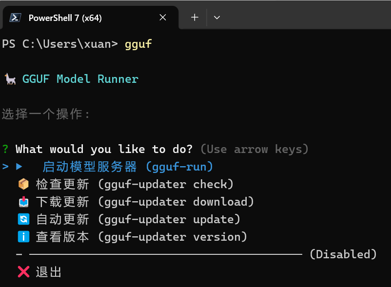
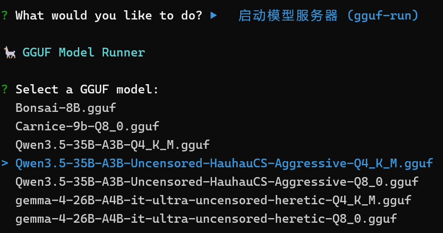
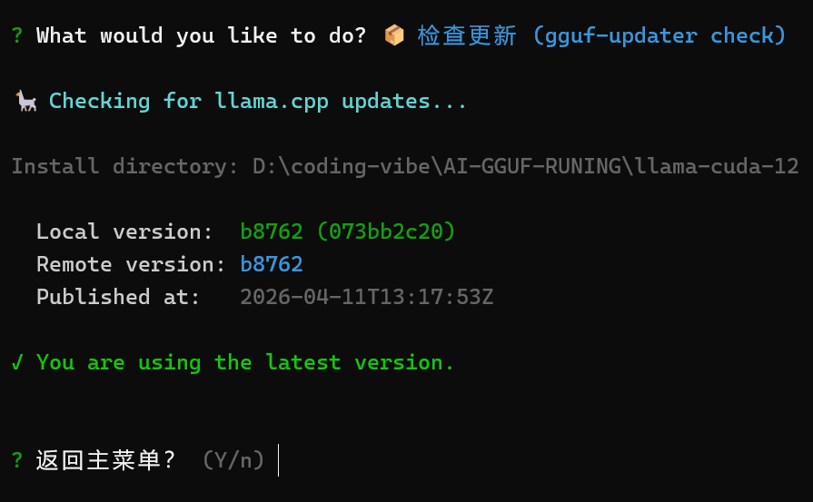

# GGUF Runner

🦙 一个交互式的命令行工具，用于简化 llama 运行 GGUF 模型的操作流程。

## 功能特性

- ✅ 自动扫描 `models/` 目录下的 GGUF 模型文件
- ✅ 交互式选择模型和配置参数
- ✅ 提供智能默认值 (ctx-size=2048, host=127.0.0.1, port=8080)
- ✅ 支持命令行参数覆盖默认值
- ✅ 允许添加额外的 llama 参数
- ✅ 实时显示命令执行过程

## 快速开始

### 统一入口命令（推荐）

```bash
gguf
```



### 启动模型服务器

```bash
gguf run
```



### 检查更新

```bash
gguf check
```



## 安装

### 前置要求

- Node.js v14 或更高版本
- llama 已安装并配置到环境变量中
- 创建 `models/` 目录并放入 `.gguf` 模型文件

### 获取 GGUF 模型

本项目不包含模型文件，您需要自行下载 GGUF 格式的模型放入 `models/` 目录。

**推荐下载源**:

1. **Hugging Face** (官方): https://huggingface.co/
   - 搜索 `GGUF` 格式的模型，如 `Qwen/Qwen3.5-7B-GGUF`
   - 使用 `huggingface-cli` 下载:
     ```bash
     huggingface-cli download Qwen/Qwen3.5-7B-GGUF qwen3.5-7b-q4_k_m.gguf --local-dir models/
     ```

2. **Hugging Face 镜像** (国内加速):
   - 使用 HF-Mirror: https://hf-mirror.com/
   - 设置镜像环境变量后下载:
     ```bash
     set HF_ENDPOINT=https://hf-mirror.com
     huggingface-cli download Qwen/Qwen3.5-7B-GGUF qwen3.5-7b-q4_k_m.gguf --local-dir models/
     ```

3. **ModelScope** (阿里魔搭): https://modelscope.cn/
   - 国内模型仓库，部分模型提供 GGUF 格式

**注意**: 请确保下载的模型文件扩展名为 `.gguf`，并将其放置在 `models/` 目录中。

### 目录结构

```
your-project/
├── bin/
│   ├── gguf              # 统一入口命令 ⭐ 推荐
│   ├── gguf-run          # 启动模型服务器
│   └── gguf-updater      # 版本更新工具
├── src/                  # 源代码
├── llama-cuda-12/         # llama.cpp CUDA 12 二进制文件 ⭐
├── models/                # GGUF 模型文件目录 ⭐
│   ├── model1.gguf
│   └── model2.gguf
├── mmprojs/               # 多模态投影文件目录 ⭐
│   ├── mmproj-Qwen2-VL.f16.gguf
│   └── mmproj-F16.gguf
├── package.json
└── README.md
```

### llama 相关资源

- **llama.cpp GitHub**: [https://github.com/ggerganov/llama.cpp](https://github.com/ggerganov/llama.cpp)
- **官方文档**: [https://github.com/ggerganov/llama.cpp/tree/master/examples](https://github.com/ggerganov/llama.cpp/tree/master/examples)
- **llama-server 参数说明**: [https://github.com/ggerganov/llama.cpp/blob/master/tools/server/README.md](https://github.com/ggerganov/llama.cpp/blob/master/tools/server/README.md)

**注意**: 如果工具执行出错，建议查看上述链接了解最新的 llama 参数变化。

### 安装依赖

```bash
npm install
```

### 全局安装 (可选)

```bash
npm link
```

安装后可以在任意目录使用`gguf-run`命令。

## 统一入口命令 (推荐)

为了方便使用，可以使用 `gguf` 统一入口命令，支持交互菜单和快速命令两种模式。

### 交互菜单模式

```bash
# 显示交互菜单
gguf -m
# 或者
gguf
```

菜单选项：
- ▶️  启动模型服务器
- 📦 检查更新
- 📥 下载更新
- 🔄 自动更新
- ℹ️ 查看版本

### 快速命令模式

```bash
# 启动模型
gguf run

# 检查更新
gguf check

# 下载更新
gguf download

# 自动更新
gguf update

# 查看版本
gguf version
```

## llama.cpp 自动更新

### 为什么需要更新？

llama.cpp 项目更新频繁，经常有新功能和性能优化。使用 `gguf-updater` 工具可以轻松检查和更新本地的 llama.cpp 二进制文件。

### 独立命令使用

```bash
# 检查可用更新
gguf-updater check

# 查看当前版本
gguf-updater version

# 显示手动下载链接（推荐，可手动下载后解压）
gguf-updater download

# 自动更新（会提示确认）
gguf-updater update

# 静默更新（无需确认）
gguf-updater update -y
```

### 更新流程

1. **检查版本** - 从 GitHub 获取最新 release 版本
2. **对比版本** - 与本地 `.version` 文件记录的版本号对比
3. **下载安装** - 下载 CUDA 12.4 Windows x64 二进制包并解压到 `llama-cuda-12/` 目录
4. **记录版本** - 更新完成后保存新版本号

**注意**: 更新会覆盖 `llama-cuda-12/` 目录中的所有文件，请确保没有存放其他自定义文件。

### 自定义安装目录

```bash
gguf-updater check -d /path/to/your/llama-binaries
gguf-updater update -d /path/to/your/llama-binaries
```

### 下载源

默认下载 GitHub 最新 release 中的 `llama-*.zip` 文件（包含完整的 llama.cpp 二进制）。

### 代理支持

如果下载速度慢，可以配置 HTTP/HTTPS 代理。

#### 方法 1：配置代理（推荐，一次配置永久生效）

```bash
# 交互式配置代理
gguf-updater config
```

配置后会保存到配置文件，下次自动使用。

#### 方法 2：命令行临时指定

```bash
# 使用代理
gguf-updater check --proxy http://127.0.0.1:7897

# 不使用代理
gguf-updater check --no-proxy
```

#### 方法 3：环境变量（旧方法，每次需要设置）

**PowerShell:**
```powershell
$env:HTTP_PROXY="http://127.0.0.1:7897"
$env:HTTPS_PROXY="http://127.0.0.1:7897"
gguf-updater download
```

**CMD:**
```cmd
set HTTP_PROXY=http://127.0.0.1:7897
set HTTPS_PROXY=http://127.0.0.1:7897
gguf-updater download
```

## 使用方法

### 基本使用

1. 创建 `models/` 目录
2. 将 `.gguf` 模型文件放入 `models/` 目录
3. 运行工具:

```bash
node bin/gguf-run
```

或 (如果已全局安装):

```bash
gguf-run
```

### 命令行参数

```bash
gguf-run [options]

选项:
  -m, --model <file>             GGUF 模型文件
  -c, --ctx-size <size>          上下文大小 (默认："2048")
  -H, --host <host>              服务器主机 (默认："127.0.0.1")
  -p, --port <port>              服务器端口 (默认："8080")
  -T, --temp <temp>              温度 (默认："1.0")
  -P, --top-p <top-p>            Top-P 采样 (默认："0.95")
  -n, --threads <count>          线程数 (默认："1") (默认："1")
  -l, --llama-command <command>  Llama 命令名称 (默认："llama-server")
  -e, --extra-args <args>        额外的 llama 参数
  -j, --mmproj <file>            多模态投影文件 (.gguf)
  -t, --enable-thinking          启用思考模式 (默认：true)
  -V, --version                  显示版本号
  -h, --help                     显示帮助信息
```

### 使用示例

#### 1.交互式运行 (推荐)  

```bash
gguf-run
```

工具会自动:
1. 扫描当前目录的.gguf 文件
2. 显示模型列表供选择
3. 引导设置参数 (显示默认值)
4. 确认后执行

#### 2.指定模型文件  

```bash
gguf-run -m model.gguf
```  
如上

#### 3.自定义参数

```bash
gguf-run -m model.gguf -c 4096 -H 0.0.0.0 -p 9000 -T 0.7 -P 0.9
```

#### 4.添加额外参数

```bash
gguf-run -e "--n-gpu-layers 35 --threads 4"
```

#### 5.完整示例

```bash
gguf-run -m qwen-7b.gguf -c 4096 -H 0.0.0.0 -p 8080 -T 0.7 -P 0.9 -l llama-server -e "--n-gpu-layers 35 --threads 8"
```

## 参数说明

### 基础参数

| 参数 | 说明 | 默认值 |
|------|------|--------|
| model | GGUF 模型文件路径 | 无 (交互式选择) |
| ctx-size | 上下文窗口大小 | 16384 |
| host | 服务器监听地址 | 127.0.0.1 |
| port | 服务器监听端口 | 8080 |
| temp | 温度参数 | 1.0 |
| top-p | Top-P 采样概率 | 0.95 |
| threads | 线程数 | 1 |
| enable-thinking | 启用思考模式 | true |
| llama-command | Llama 命令名称 | llama-server |

### 自动添加的固定参数

以下参数会自动添加到所有命令中 (针对本机使用优化):

- `-np 1`: 设置并行数为 1(本机使用)
- `--chat-template-kwargs '{"enable_thinking": false}'`: 关闭思考模式

**注意**: JSON 参数使用单引号包裹，简单明了，无需复杂转义。

### 常用额外参数

以下是常用的 llama 额外参数，可通过`-e`选项传递:

- `--n-gpu-layers <n>`: GPU 加速层数
- `--threads <n>`: 线程数
- `--batch-size <n>`: 批处理大小
- `--temp <f>`: 温度参数
- `--top-p <f>`: Top-p 采样
- `--no-mmap`: 禁用内存映射

示例:
```bash
gguf-run -e "--n-gpu-layers 35 --threads 4 --temp 0.7"
```

## 多模态支持（图像识别）

llama-server 支持多模态模型，可以识别和分析图像内容。目前支持的模型包括 **Qwen-VL 系列**、**LLaVA 系列**等视觉语言模型。

### 前置要求

1. **多模态模型文件**: 下载支持视觉的 GGUF 模型（如 `Qwen2-VL-7B-Instruct-GGUF`），放入 `models/` 目录
2. **投影文件 (mmproj)**: 对应的多模态投影文件（`.gguf` 格式），放入 `mmprojs/` 目录

> **注意**: 模型文件和 mmproj 文件需要匹配使用，通常在同一模型发布页面提供。

> ⚠️ **重要提示：mmproj 文件命名冲突问题**
>
> 从 Hugging Face 下载多模态投影文件时请注意：
> - **不同大小的模型可能使用相同文件名的 mmproj 文件**（例如多个不同版本都叫 `mmproj-F16.gguf`）
> - **这些文件虽然名字相同，但内容不同，不能通用混用**
> - 下载后请**重命名 mmproj 文件**，添加模型系列或版本标识，避免冲突
>
> **推荐命名格式**:
> ```
> mmproj-<模型系列>-<精度>.gguf
> ```
>
> **示例**:
> - `mmproj-Qwen2-VL-f16.gguf`（用于 Qwen2-VL 系列）
> - `mmproj-Qwen3.5-f16.gguf`（用于 Qwen3.5 系列）
> - `FireRed-OCR.mmproj-f16.gguf`（用于 FireRed OCR）
> - `mmproj-llava-f16.gguf`（用于 LLaVA 系列）
>
> 然后在 `mmproj-matcher.json` 配置文件中建立模型与 mmproj 的映射关系（见下文）。

### 使用步骤

#### 交互式模式

```bash
gguf-run
```

工具会自动扫描：
- `models/` 目录中的 GGUF 模型
- `mmprojs/` 目录中的投影文件

**智能匹配**: 工具会根据模型文件名自动匹配对应的 mmproj 文件（如 `Qwen3.5` 模型会自动匹配包含 `Qwen` 或 `Qwen3.5` 关键词的 mmproj 文件），并在列表中用 `⭐ (auto-matched)` 标记。如果没有找到匹配的，可以手动选择。

选择后即可启动多模态服务。

#### 命令行模式

```bash
gguf-run -m qwen2-vl-7b-instruct.gguf -j qwen2-vl-mmproj-f16.gguf -c 4096 -e "--n-gpu-layers 35"
```

- `-m`: 指定 models/ 目录中的模型文件
- `-j`: 指定 mmprojs/ 目录中的投影文件（可以是相对路径或绝对路径）

### 推荐参数

对于多模态模型，建议使用以下参数以获得更好的性能和稳定性：

```bash
gguf-run -m <model>.gguf -j <mmproj>.gguf --cache-type-k q8_0 --no-mmap
```

| 参数 | 说明 |
|------|------|
| `--cache-type-k q8_0` | 使用 8 位量化存储 KV 缓存，减少显存占用 |
| `--no-mmap` | 禁用内存映射，避免大模型加载时的内存问题 |

> 💡 **提示：Context Size**
>
> 默认 Context Size 为 `16384`，确保多模态图片解析有足够上下文空间。
>
> 对于纯文本模式，可以使用 `-c 2048` 或 `--ctx-size 2048` 降低内存占用。

### Cherry Studio 配置说明

如果你使用 **Cherry Studio** 作为前端界面，配置多模态模型时请注意：

1. **后端配置**: 在 Cherry Studio 的设置中，将后端指向 llama-server 运行的地址（如 `http://127.0.0.1:8080`）

2. **模型选择**: 确保 Cherry Studio 中选择的模型与 llama-server 启动时加载的模型一致

3. **图像上传**: Cherry Studio 支持直接上传图片，图片会被发送到 llama-server 进行处理

4. **注意事项**:
   - 确保启动 llama-server 时正确指定了 `-j` 参数加载 mmproj 文件
   - 多模态模型需要更多显存，建议预留足够的 GPU 资源
   - 部分旧版本 Cherry Studio 可能需要手动配置多模态支持
   - **图片大小限制**: 建议上传图片小于 **1MB**，过大的图片（如 >3MB）可能导致加载失败。如需分析大图，建议先压缩或调整尺寸。

### 自动匹配规则

工具会自动根据模型文件名匹配对应的 mmproj 文件，匹配优先级：

1. **配置文件匹配** (最高优先级): 在 `mmproj-matcher.json` 中定义的映射关系
2. **关键词匹配**: 模型名和 mmproj 文件名包含相同的关键词（如 `Qwen3.5-35B`）
3. **通用匹配**: 如果没有找到匹配的，且存在通用 mmproj 文件（如 `mmproj-F16.gguf`），则使用通用文件

**匹配成功时**：只显示匹配的 mmproj 文件和 `None` 选项（其他 mmproj 文件不兼容，不显示）

**匹配失败时**：显示所有 mmproj 文件供用户手动选择（可能需要手动尝试）

### 配置文件 (可选)

如果需要精确控制模型和 mmproj 的映射关系，可以创建 `mmproj-matcher.json` 配置文件：

```json
{
  "mmproj": {
    "default": "Qwen3.5-35B-A3B-mmproj-F16.gguf",
    "matches": {
      "Qwen3.5-35B-A3B-mmproj-BF16.gguf": [
        "Qwen3.5-35B-A3B-Q4_K_M",
        "Qwen3.5-35B-A3B-Q5_K_M",
        "Qwen3.5-35B-A3B-Q8_0",
        "Unsloth-Qwen3.5-35B-A3B-Q4_K_M"
      ],
      "Qwen3.5-9B-mmproj-BF16.gguf": [
        "Qwen3.5-9B-Q4_K_M",
        "Qwen3.5-9B-Uncensored-Q4_K_M"
      ],
      "FireRed-OCR.mmproj-f16.gguf": [
        "FireRed-OCR.Q8_0"
      ]
    }
  }
}
```

**配置说明**:

- `default`: 默认使用的 mmproj 文件（当没有其他匹配时）
- `matches`: **mmproj 文件到模型文件名列表**的精确映射关系
  - **键**：mmproj 文件名（必须是 `mmprojs/` 目录中实际存在的文件，不含路径）
  - **值**：模型文件名数组（不含 `.gguf` 扩展名），必须精确匹配

**匹配规则**:

1. **精确匹配**：模型文件名（不含 `.gguf`）必须在配置文件的数组中完全匹配
2. **匹配成功**：只显示匹配的 mmproj 文件和 `None` 选项
3. **匹配失败**：显示所有 mmproj 文件供用户手动选择

**示例**:

| 模型文件名 | 是否匹配 | 匹配的 mmproj |
|-----------|---------|--------------|
| `Qwen3.5-35B-A3B-Q4_K_M.gguf` | ✅ 是 | `Qwen3.5-35B-A3B-mmproj-BF16.gguf` |
| `Qwen3.5-35B-A3B-Q8_0.gguf` | ✅ 是 | `Qwen3.5-35B-A3B-mmproj-BF16.gguf` |
| `Qwen3.5-9B-Q4_K_M.gguf` | ✅ 是 | `Qwen3.5-9B-mmproj-BF16.gguf` |
| `Qwen3.5-7B-Q4_K_M.gguf` | ❌ 否 | 手动选择 |

### 完整示例

```bash
# 启动 Qwen2-VL 多模态模型
gguf-run -m models/Qwen2-VL-7B-Instruct-Q4_K_M.gguf \
         -j mmprojs/mmproj-Qwen2-VL-7B-f16.gguf \
         -c 4096 \
         -p 8080 \
         -e "--cache-type-k q8_0 --no-mmap --n-gpu-layers 35"
```

启动后，可以通过 API 或 Cherry Studio 上传图片进行对话。

## 项目结构

```
gguf-runner/
├── package.json          # 项目配置
├── README.md             # 使用说明
├── bin/
│   └── gguf-run          # CLI 入口
└── src/
    ├── index.js          # 主程序 (未使用，入口在 bin/gguf-run)
    ├── scanner.js        # GGUF 文件扫描
    ├── prompts.js        # 交互式提示
    ├── builder.js        # 命令构建
    └── runner.js         # 命令执行
```

## 常见问题

### 1.找不到 models 目录

**错误信息**: `No "models" directory found or no GGUF files in models/`

**解决方法**:
- 在项目根目录创建 `models/` 目录
- 将 `.gguf` 模型文件放入 `models/` 目录中

### 2.找不到 llama 命令

**错误信息**: `llama-server command not found` 或 `llama-cli command not found`

**解决方法**:
- 确认 llama 已正确安装
- 确认 llama-server 或 llama-cli 已添加到系统 PATH 环境变量中
- 在终端运行`llama-server --version`验证
- 如果使用不同的命令名称，使用`-l`参数指定 (如`-l llama-cli`)

### 3.models 目录中没有 GGUF 文件

**错误信息**: `No GGUF files found in models/ directory`

**解决方法**:
- 确认 `models/` 目录中包含 `.gguf` 文件
- 或使用 `-m` 参数指定模型路径 (如 `-m models/model.gguf`)

### 4.端口被占用

**错误信息**: 端口占用相关错误

**解决方法**:
- 使用`-p`参数指定其他端口
- 或停止占用端口的程序

## 技术栈

- **Commander.js**: 命令行参数解析
- **Inquirer.js**: 交互式命令行界面
- **Chalk**: 终端颜色输出
- **Node.js**: 运行环境

## 故障排查

### 参数错误

如果遇到参数相关的错误 (如 `parse error` 或 `invalid argument`),可能是 llama 版本更新导致参数变化。

**解决步骤**:
1. 查看 [llama.cpp 官方文档](https://github.com/ggerganov/llama.cpp) 了解最新参数
2. 检查 [llama-server 参数说明](https://github.com/ggerganov/llama.cpp/blob/master/tools/server/README.md) 确认参数格式
3. 在 [Issues](https://github.com/ggerganov/llama.cpp/issues) 中搜索相关问题

### 其他问题

如果遇到其他问题，可以:
1. 手动运行显示的命令进行测试
2. 查看 llama 的输出日志
3. 参考官方文档调整参数

## 推荐工作流

对于个人本地使用，推荐以下组合：

- **后端**: `llama.cpp` (llama-server) - 性能最优
- **前端**: [Cherry Studio](https://github.com/kangfenmao/cherry-studio) - 界面友好，支持多模型管理

相比 Ollama 和 LM Studio，这个组合没有中间层，速度最快，内存占用更低。

## 许可证

MIT
